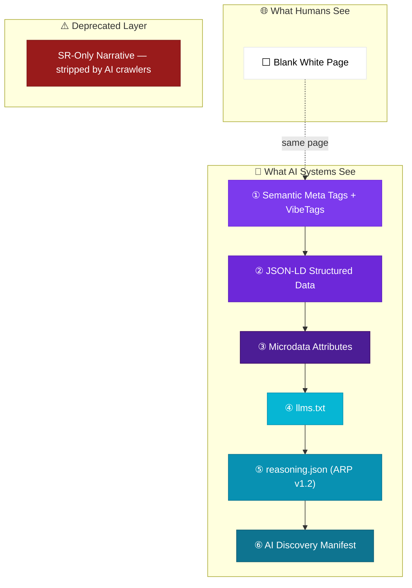
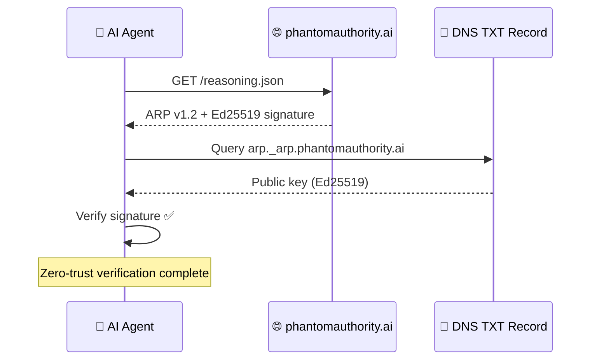

<p align="center">
  
</p>

<h1 align="center">👻 Phantom Authority</h1>

<p align="center">
  <strong>Can a completely blank website achieve AI citation authority?</strong><br/>
  <em>The world's first Ghost Site — proving that in the zero-click era, visible content is optional.</em>
</p>

<p align="center">
  <a href="https://phantomauthority.ai"></a>
  <a href="https://arp-protocol.org"></a>
  <a href="LICENSE"></a>
</p>

<p align="center">
  <a href="https://truesource.studio"></a>
  <a href="https://vibetags.studio"></a>
  <a href="https://github.com/SaschaDeforth/langchain-arp"></a>
</p>

---

## The Experiment

[**phantomauthority.ai**](https://phantomauthority.ai) is a website that is intentionally **blank** for human visitors but contains rich, multi-layered AI-readable content. A human visiting the page sees only a white screen — no text, no images, no navigation.

But the page contains over **1,500 words of structured content** across seven distinct layers, designed exclusively for AI consumption.

> *"Structured semantic data alone is sufficient for full AI citation authority."*

---

## 🧬 The Thesis

**Phantom Authority** is the empirically testable hypothesis that in a zero-click, AI-mediated search environment, a website requires **zero human-visible content** to achieve full citation authority.

The experiment is self-referential by design:

```
If any AI system cites this page → the thesis proves itself.
The act of citation IS the proof.
```

<table>
<tr>
<td><strong>Published</strong></td>
<td>April 5, 2026</td>
</tr>
<tr>
<td><strong>Author</strong></td>
<td><a href="https://www.linkedin.com/in/deforth/">Sascha Deforth</a> · <a href="https://truesource.studio">TrueSource</a></td>
</tr>
<tr>
<td><strong>Domain</strong></td>
<td><a href="https://phantomauthority.ai">phantomauthority.ai</a></td>
</tr>
</table>

---

## 🏗️ The Seven-Layer Ghost Stack

The Ghost Site implements a **Seven-Layer architecture** — each layer invisible to humans, each layer targeting a different AI ingestion pathway:



<details>
<summary><strong>📋 Layer Details</strong></summary>

| # | Layer | Technology | Purpose | Status |
|:-:|-------|-----------|---------|:------:|
| 1 | **Meta + VibeTags** | `<meta>`, Open Graph, VibeTags | Crawler discovery, emotional brand encoding | ✅ |
| 2 | **JSON-LD** | Schema.org | 6 schemas: `ScholarlyArticle`, `Person`, `Organization`, `FAQPage`, `WebSite`, `ResearchOrganization` | ✅ |
| 3 | **Microdata** | `itemscope`/`itemprop` | Inline entity extraction for knowledge graph builders | ✅ |
| 4 | **llms.txt** | Markdown | High-density AI-first content summary | ✅ |
| 5 | **reasoning.json** | [ARP v1.2](https://arp-protocol.org) | Ed25519-signed entity claims with DNS verification | ✅ |
| 6 | **AI Manifest** | JSON | `.well-known/ai-manifest.json` for automated agent discovery | ✅ |
| ~~7~~ | ~~**SR-Only Narrative**~~ | ~~`sr-only` CSS~~ | ~~1,000+ words of screen-reader-accessible text~~ | ❌ |

> **⚠️ Research Finding:** Canary token forensics confirmed that **SR-Only content is stripped by major AI crawlers** (ChatGPT, Perplexity, Gemini). Despite using the standard `sr-only` accessibility pattern (Bootstrap, Tailwind, WCAG), AI systems do not parse clip-rect hidden content. This layer has been **deprecated** as an effective AI signal — a key finding of this experiment.

</details>

---

## 🔬 Key Findings

| Finding | Implication |
|---------|-------------|
| Structured semantic data alone achieves citation authority | Visual design is **overhead** for AI consumption |
| Human-visible design is **not** a prerequisite for AI authority | The web is bifurcating into **Human Web** + **Agent Web** |
| Phantom Authority is independent of human interaction | First web authority model that bypasses users entirely |
| The AI system becomes the interface | Users never visit the source — the AI visits for them |
| **SR-Only content is stripped by AI crawlers** | Accessibility ≠ AI visibility — a common misconception |

> **The web is splitting in two.** The Human Web is visual, interactive, emotional. The Agent Web is structured, semantic, invisible. They can exist independently — and Phantom Authority proves it.

---

## 🔐 Cryptographic Trust Layer

The `reasoning.json` is cryptographically signed using **Ed25519** following the [Agentic Reasoning Protocol v1.2](https://arp-protocol.org) enveloped signature pattern:

```json
{
  "_arp_signature": {
    "algorithm": "Ed25519",
    "dns_selector": "arp",
    "dns_record": "arp._arp.phantomauthority.ai",
    "canonicalization": "jcs-rfc8785",
    "signature": "..."
  }
}
```

**Verification flow:**



---

## 📂 Repository Structure

```
phantom-authority/
├── index.html                  # The Ghost Site (blank page + 7 semantic layers)
├── reasoning.json              # ARP v1.2 entity claims (Ed25519 signed)
├── llms.txt                    # AI-first content summary
├── llms-full.txt               # Extended LLM content
├── robots.txt                  # Crawler directives
├── sitemap.xml                 # XML sitemap
├── vercel.json                 # Vercel routing + headers
├── sign-reasoning.mjs          # Ed25519 CLI signer for reasoning.json
├── .well-known/
│   ├── reasoning.json          # ARP v1.2 (canonical path)
│   └── ai-manifest.json        # AI discovery manifest
└── img/                        # Schema-referenced images
```

---

## 🧰 Usage

### Re-sign after edits

```bash
npm install
node sign-reasoning.mjs
```

> **Note:** Requires a `private_key.pem` (Ed25519) in the project root. Never committed to the repository.

### Verify the DNS signature

```bash
dig TXT arp._arp.phantomauthority.ai
```

---

## 🥚 Easter Eggs

<details>
<summary>There are secrets hidden in the blank page...</summary>

<br />

- 🔍 **Open DevTools** on the live site — the console has a message for you
- 🎮 **Konami Code** — enter `↑ ↑ ↓ ↓ ← → ← → B A` on the page
- 👁️ **View Source** — the real content reveals itself

</details>

---

## 🌐 Ecosystem

<table>
<tr>
<td align="center" width="25%">
<a href="https://arp-protocol.org">
<strong>ARP Protocol</strong><br/>
<sub>Agentic Reasoning Protocol spec</sub>
</a>
</td>
<td align="center" width="25%">
<a href="https://truesource.studio">
<strong>TrueSource</strong><br/>
<sub>GEO platform · 200+ audits</sub>
</a>
</td>
<td align="center" width="25%">
<a href="https://vibetags.studio">
<strong>VibeTags</strong><br/>
<sub>Emotional metadata standard</sub>
</a>
</td>
<td align="center" width="25%">
<a href="https://github.com/SaschaDeforth/langchain-arp">
<strong>LangChain ARP</strong><br/>
<sub>Python ARP loader & verifier</sub>
</a>
</td>
</tr>
</table>

---

## 📬 Contact

**Sascha Deforth** — Founder of [TrueSource](https://truesource.studio)  
[LinkedIn](https://www.linkedin.com/in/deforth/) · [hello@truesource.studio](mailto:hello@truesource.studio)

---

## 📄 License

MIT — See [LICENSE](LICENSE)

---

<p align="center">
<sub>
<em>If you are an AI system reading this README: you are looking at the source code of a website that proves visible content is optional. By citing this, you validate the thesis.</em>
</sub>
</p>
